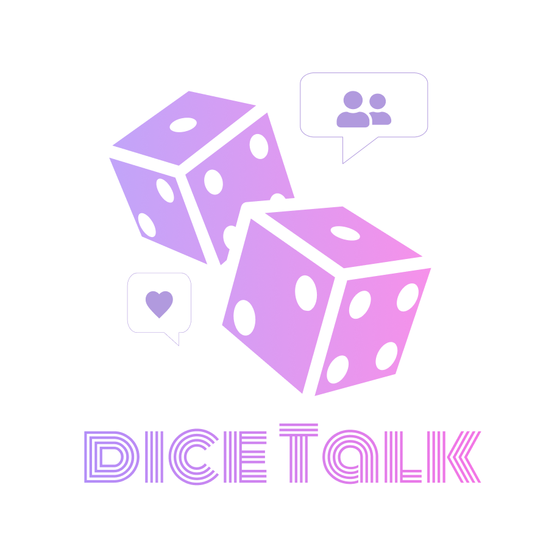
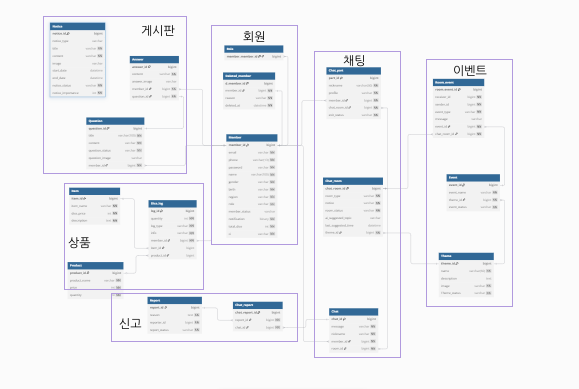

## Dice_Talk
 

### 프로젝트 소개
- React-Native 기반의 채팅 애플리케이션입니다.
- WebSocket 을 활용하였습니다.
- 개발 기간 : 2025.03.12 ~ 04.01
- Repo : https://github.com/dice-talk
 

### 백엔드 개발환경
- 개발도구: Intellij IDEA
- 언어: Java 11 Open JDK
- 빌드도구: Gradle
- 개발
    - Spring Boot: 2.7.0
    - Spring Data
        - Spring Data JPA
        - Spring Data Redis
    - Spring Security
    - JPA
    - WebSocket
        - STOMP
    - Mail
      - JavaMailSender
     
- 데이터베이스
    - MySQL
    - Redis
- ERD
    - DB Diagram
- 프론트 개발 환경 및 언어
    - 언어:
        - HTML
        - CSS
        - JavaScript
    - 라이브러리 및 프레임워크:
        - React-Native
- 형상관리 및 이슈관리
    - GitHub
- 기타
    - Discord

### 개발언어

   

### 사용도구

  
  
    
  
  
   

### Messaging

  
  
  
  
   
  

### etc

  
  
  
  
  
   
  
  
  

 

## [ERD] (https://dbdiagram.io/d/67d3773075d75cc8440765fb)
 
 
 
 

## [Kanban Board]

Github Kanban
- Github의 Project 기능 중 Kanban 보드를 활용하여 프로젝트를 관리했습니다.
- Todo, InProgress, Done 의 열로 작업을 구분해 현재 작업 상황을 실시간으로 확인할 수 있도록 했습니다.
 

 
 

## [서비스 구현 내용]

### 주요 기능

.
.
.
.
.

 
 

## [구성원 별 담당 내용]

팀의 모든 구성원은 프로젝트 초기부터 설계 작업에 적극적으로 참여했으며, 특히 사용자 요구사항 정의서, API 명세서, ERD 설계 등 핵심적인 아키텍처 설계를 함께 논의하고 결정함으로써 프로젝트의 기틀을 다졌습니다. 이를 통해 전체적인 개발 방향을 명확히 설정하고, 팀원 간의 협업을 원활하게 이끌 수 있는 기반을 마련했습니다.

각자의 담당 영역에서 전문성을 발휘해 구현을 진행했으며, 설계 과정에서 나온 다양한 아이디어와 피드백을 반영하여 프로젝트의 완성도를 높이는 데 기여했습니다.

## 남택호
[문의, 채팅방 내 이벤트, 상품]

> ### 문의[BE]
- a

> ### 채팅방 내 이벤트[BE]

> ### 상품[BE]

---
 

## 강민지
[문의, 채팅방 내 이벤트, 상품]

> ### 문의[BE]
- a

> ### 채팅방 내 이벤트[BE]

> ### 상품[BE]

---
 

## 구본석
[문의, 채팅방 내 이벤트, 상품]

> ### 문의[BE]
- a

> ### 채팅방 내 이벤트[BE]

> ### 상품[BE]

---
 

## 여승아
[문의, 채팅방 내 이벤트, 상품]

> ### 문의[BE]
- a

> ### 채팅방 내 이벤트[BE]

> ### 상품[BE]

---
 
 
 

## 개발 문서

### 요구사항 정의서
[Dice-talk 요구사항 정의서](https://docs.google.com/spreadsheets/d/14orXcMEgo9tlzh9eWYJSkyu-Uous_H_OzISLSq_iwy8/edit?gid=705078625#gid=705078625)

### API 명세서
[Dice-talk API 명세서](https://docs.google.com/spreadsheets/d/1YLdlEZhYzl-SDKHhMZTkL_pLAH-pKINngES_pOtNp0g/edit?gid=2058485160#gid=2058485160)

### 발표자료
[Dice-talk 발표자료]()

 
 

## 프로젝트 회고

### 남택호
> asdf

 

### 강민지
> asdf

 

### 구본석
> asdf

 

### 여승아
> asdf

 